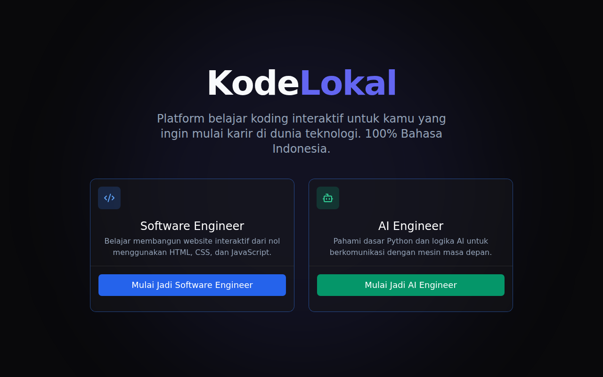
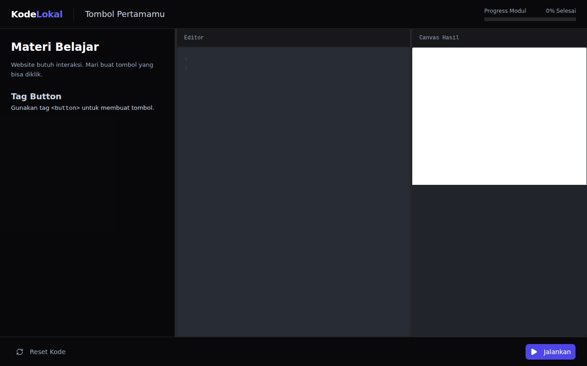
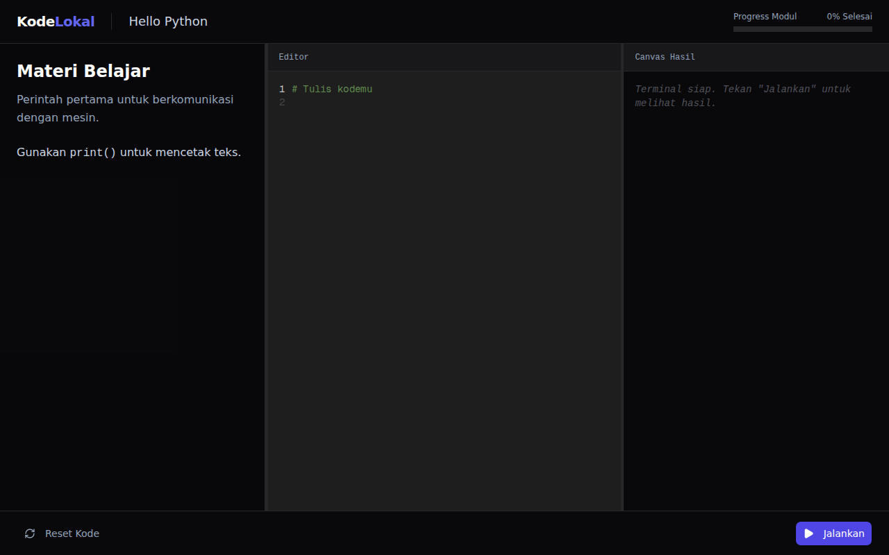

# KodeLokal 🇮🇩

  

**KodeLokal** adalah platform belajar koding interaktif untuk pemula di Indonesia. Dibangun dengan desain premium dan 100% menggunakan Bahasa Indonesia, platform ini membantu calon *Software Engineer* dan *AI Engineer* untuk memulai langkah pertamanya di dunia teknologi.

## ✨ Fitur Utama (Features)

- **100% Bahasa Indonesia**: Seluruh UI, instruksi, dan pesan error menggunakan Bahasa Indonesia yang ramah dan suportif (Tone: Santai seperti mentor).
- **Dua Jalur Pembelajaran (Tracks)**:
  - 🌐 **Software Engineer**: Belajar membangun website interaktif dari nol menggunakan HTML, CSS, dan JavaScript (Dilengkapi *Live Canvas HTML Preview*).
  - 🤖 **AI Engineer**: Pahami dasar sintaksis Python dan logika AI untuk berkomunikasi dengan mesin (Dilengkapi *Simulasi Terminal Output*).
- **Interactive 3-Pane Workspace**: Pengalaman koding yang imersif terbagi menjadi Materi, Code Editor, dan Live Preview/Terminal dalam satu layar (Resizable).
- **Sistem Validasi Pintar**: Secara otomatis memeriksa jawaban (DOM Validation untuk HTML & Regex Logic untuk Python) dan memberikan *feedback* langsung.
- **Premium Dark Mode**: Tampilan UI eksklusif terinspirasi dari standar desain global (UI8/Vercel) menggunakan Tailwind CSS & Shadcn.

## 📸 Screenshots

### The Classroom (Interactive IDE) - Jalur Software Engineer

  

### The Classroom (Interactive IDE) - Jalur AI Engineer

  

## 🛠️ Tech Stack

KodeLokal dibangun menggunakan teknologi modern untuk performa dan pengalaman pengguna terbaik:

- **Framework**: [Next.js 14](https://nextjs.org/) (App Router)
- **Bahasa**: [TypeScript](https://www.typescriptlang.org/)
- **Styling**: [Tailwind CSS](https://tailwindcss.com/)
- **UI Components**: [Shadcn UI](https://ui.shadcn.com/) (Radix Primitives)
- **Icons**: [Lucide React](https://lucide.dev/)
- **State Management**: [Zustand](https://docs.pmnd.rs/zustand/getting-started/introduction)
- **Live Code Editors**:
  - `@codesandbox/sandpack-react` (Untuk Live HTML Preview)
  - `@monaco-editor/react` (Untuk simulasi Terminal Python)

## 🚀 Cara Menjalankan Proyek Secara Lokal (How to Run)

Ikuti langkah-langkah berikut untuk menjalankan KodeLokal di mesin lokal kamu:

1. **Clone Repository**
   \`\`\`bash
   git clone https://github.com/username/kodelokal.git
   cd kodelokal
   \`\`\`

2. **Install Dependencies**
   Pastikan kamu sudah menginstal Node.js versi 18 ke atas.
   \`\`\`bash
   npm install
   \`\`\`

3. **Jalankan Server Development**
   \`\`\`bash
   npm run dev
   \`\`\`

4. **Buka di Browser**
   Buka \`http://localhost:3000\` di browser kamu untuk melihat hasilnya.

---

> *Dokumen panduan asli (PRD, Aturan, Silabus Data) telah dipindahkan ke folder `docs/` untuk kerapian.*